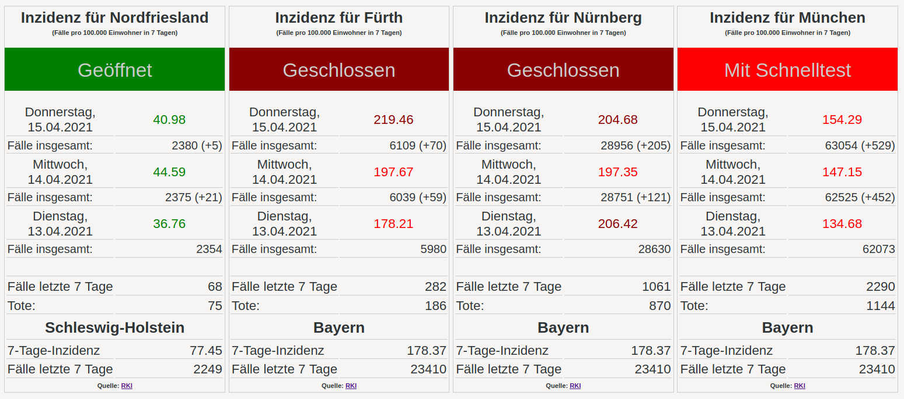

# 7-Tage-Inzidenz Anzeige mit PHP als Container

7-Tage-Inzidenz Anzeige für mehrere Landkreise und Städte mit Daten des RKI basierend auf dem Artikel [Corona-Ampel](https://ct.de/yw1c) in c’t 9/2021 ab Seite 160.





Die Beispiele sind alle mit `podman`, was aber 1:1 durch `docker` ersetzt werden kann.

## Container bauen

Um den Container selber zu bauen, dieses Projekt auschecken und dann in das Verzeichnis wechseln. 

```
# podman build -t 7-tage-inzidenz .
```

## Container ausführen

```
# podman run -d --rm --name 7-tage-inzidenz -p 80:80  thkukuk/7-tage-inzidenz:latest
```

Der Container legt einen Cache an. Dieser geht verloren wenn man den Container neu startet. Um nur die aktuellen Tages-Zahlen anzuzeigen ist das in Ordnung, aber für mehrtägige Anzeigen mit verlauf sollten die Daten persistent gespeichert werden:

```
podman run -d --rm -v /srv/7-ge-inzidenz/data:/data --name 7-tage-inzidenz -p 80:80  7-tage-inzidenz:latest
```
